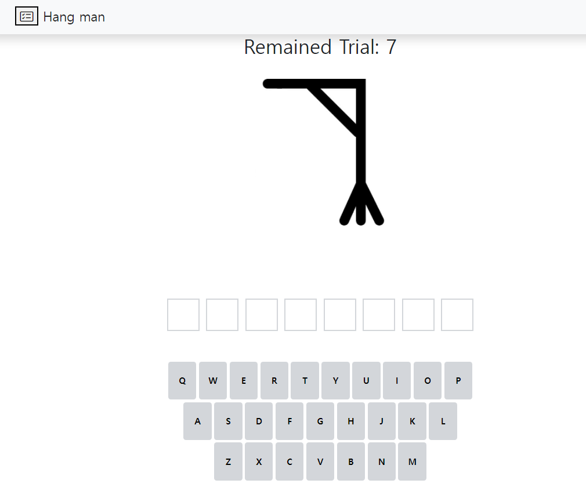
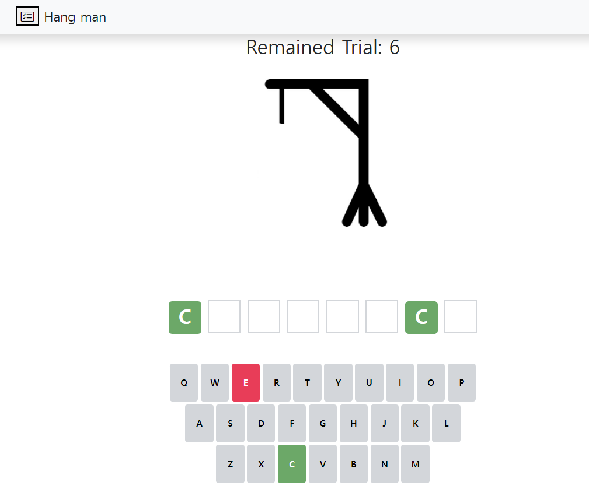
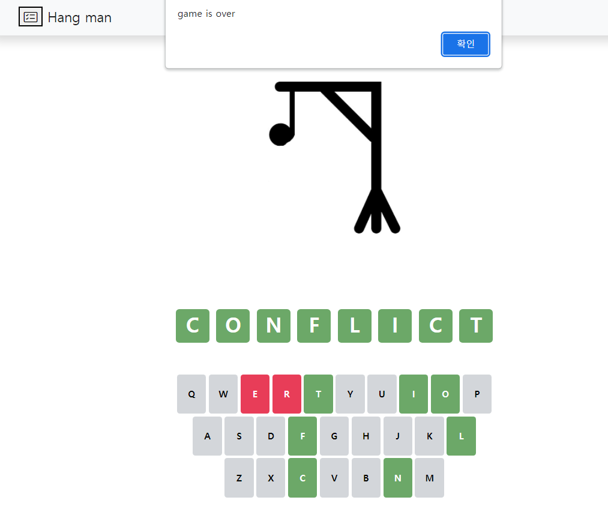

 

## Thumbnail

---
## Navigation

- [Thumbnail](#thumbnail)
- [Navigation](#navigation)
- [OSSP TEAM 3 MEMBER](#ossp-team-3-member)
- [Introduction](#introduction)
- [Main Menu](#main-menu)
- [In Game](#in-game)
- [Hosting](#hosting)
- [Installation](#installation)
- [Stack](#stack)
- [Link for Presentation](#link-for-presentation)
---
## OSSP TEAM 3 MEMBER
 

| Name | Student Num | Email | GitHub |
| -- | -- | -- | -- | 
| 민수영 | 2017314656 | sujae9704@gmail.com | https://github.com/Suyoung-Min |
| 박주현 | 2018311901 | joo6734@g.skku.edu | https://github.com/PeaceCodemath |
| 김찬용 | 2019311237 | cksdyd8350@gmail.com | https://github.com/cycy-kim |

---
## Introduction
 

**Hangman** is a word guessing game.  
Guess a word, phrase by suggesting letters within a certain number of guesses. 

---
## Main Menu

Main menu has 2 options to set word to in_game.
> 1. Custom word
> 2. Random word by Level

Custom word option set user's own word to in_game, and hand it over other users.  
Random word option set word randomly according to level (Easy, Medium, Hard).  
The word will be randomly selected from parsed.json made by web crawling.

---
## In Game

By setting the target word from Main Menu, game will start.  
And an empty guillotine appears on the main screen.

If the user chooses the letter that is included in the word, The letter is filled in the square at the position of the letter in the word, and the letter is not selectable.

Conversely, if you choose a letter that is not included in a word,  
the opportunity decreases and the key of the wrong word turns red and user cannot choose.  
And a picture is added to the guillotine.

If user find all the letters of the word with the number of attempts left,  
the game ends with the user's victory.

Conversely, if a word is not found within the number of attempts, the hang-man is made and the user loses.

At the end of the game, user can use the share function, which shows how user found the word, and answer. And allows user to copy the result to the clipboard so that user can share it with others.

The result can be shared by Kakaotalk, or other chat program.

---
## Hosting

 
This project is hosted by GitHub Page Hosting.

https://suyoung-min.github.io/Hang-man/

---
## Installation

 
This project use bootstrap 5.2.2, jquery 3.6.1 by CDN.
Therefore, it is immediately available without any other installation process.

---
## Stack

We use HTML, CSS, JavaScript, Bootstrap, jQuery.

 

---
## Link for Presentation

https://youtu.be/-9tQc1o688E

우수 프로젝트 시상 프로그램에 지원합니다

